= Product Rating Portal
:author: Florian Weingartshofer
:email: <S1910307103@students.fh-hagenberg.at>
:reproducible:
:experimental:
:listing-caption: Listing
:source-highlighter: rouge
:rouge-style: github
:toc:
:sectnums:
:sectnumlevels: 6
:toclevels: 6
// Variables
:src: ../src/
:img: ./img
:imagesoutdir: ./out

<<<
== Lösungsidee

Ist wird eine Produkt Bewertungsseite laut Angabe erstellt.
Hier bei wird stark auf die in der LVA vorgestellte Architektur gesetzt.

Es gibt eine einfach gehaltene Landing-Page, von dieser kann der User zum Login, Registrieren navigieren,
oder er geht direkt zur Produktübersicht.
Anders als im Bookshop werden die Produkte nicht mit einem Table dargestellt, sondern mit Bootstrap-Cards.

Die einzelnen Produkte kann der User auch genauer betrachten und sie editieren, sollte er der Ersteller des Produkts sein.

Es wurden einige Konzepte und Klassen aus dem Bookshop wiederverwendet.

<<<

== Datenbank

Das Datenbank-Modell besteht aus vier Tabellen:

- Users
- Categories: Jedes Produkt gehört *genau* einer Kategorie an.
- Products: Jedes Produkt hat eine Kategorie und wurde von einem User erstellt.
- Ratings: Enthält einen Score, sowie optional einen Titel und eine Beschreibung.
Gehört zu einem Produkt und wird von einem User erstellt.
Es wird automatisch das Erstelldatum gespeichert, dieses gibt, an wann die erste Version des Ratings veröffentlicht wurde,
und wird bei einem Update nicht aktualisiert.

=== Schema

[plantuml]
....
hide circle

entity users {
  * id: int <<primary key, generated>>
  --
  * username: varchar(45) <<unique, not null>>
  * password: varchar(255) <<not null>>
}

entity categories {
  * id: int <<generated, not null>>
  --
  * name: varchar(45) <<unique, not null>>
}

entity products {
  * id: int <<primary key, generated>>
  --
  * userId: int <<foreign key, not null>>
  * categoryId: int <<foreign key, not null>>
  --
  * name: varchar(45) <<not null>>
  * manufacturer: varchar(255) <<not null>>
  * description: varchar(255) <<not null>>
}

entity ratings {
  * id: int <<primary key, generated>>
  --
  * productId: int <<foreign key, not null>>
  * userId: int <<foreign key, not null>>
  --
  * score: Int <<not null>>
  title: varchar(255)
  content: varchar(1000)
}

users ||--o{ products
categories ||--o{ products
products ||--o{ ratings
users ||--o{ ratings
....

<<<

=== Scripts

.Create
[source,sql]
----
include::{src}/DB_CREATE.sql[]
----

<<<

.Insert
[source,sql]
----
include::{src}/DB_INSERT.sql[]
----

<<<

== Architektur

Es wird die zur Verfügung gestellte Dependency Injection genutzt, mithilfe des `ServiceProvider`.

=== Repositories

Es wird das Repository Pattern eingesetzt, allerdings wird jedes Interface von einer einzelnen Klasse implementiert.
Ähnlich wie in der Übung.

=== Queries and Commands

Als Zwischenschicht für Repositories und Controller werden Queries und Commands genutzt.
Queries sind für einfache Abfragen(zB für die Datenbank) und Commands sind Klassen die etwas verändern, zB `Insert` in einer Datenbank.

=== Entities

Bilden die Datenbank in PHP-Klassen ab.

=== DTOs

Anders als in der Übung werden nicht Data Objekte genutzt, sondern DTOs, welche prinzipiell ident von der Nutzung sind, nur anders benannt.

=== Views

Es gibt Views für alle Produkte, inklusive Suche, eine Produkt-Detail-Ansicht, sowie eine Ansicht zum Editieren und Hinzufügen von Produkten.

Es gibt Möglichkeiten für den User sich anzumelden oder zu registrieren, dies wurde mit PHP Sessions implementiert.

=== Services

Es gibt einen AuthenticationService, welcher die Login-Session des Users verwaltet.

<<<

== Source-Code

=== Application/Entities

.User.php
[source,php]
----
include::../src/src/Application/Entities/User.php[]
----

<<<

.Category.php
[source,php]
----
include::../src/src/Application/Entities/Category.php[]
----

<<<

.Product.php
[source,php]
----
include::../src/src/Application/Entities/Product.php[]
----

<<<

.Rating.php
[source,php]
----
include::../src/src/Application/Entities/Rating.php[]
----

<<<

=== Application/DTOs

.UserDTO.php
[source,php]
----
include::../src/src/Application/DTOs/UserDTO.php[]
----

<<<

.CategoryDTO.php
[source,php]
----
include::../src/src/Application/DTOs/CategoryDTO.php[]
----

<<<

.ProductDTO.php
[source,php]
----
include::../src/src/Application/DTOs/ProductDTO.php[]
----

<<<

.RatingDTO.php
[source,php]
----
include::../src/src/Application/DTOs/RatingDTO.php[]
----

<<<

=== Application/Interfaces

.CategoryRepository.php
[source,php]
----
include::../src/src/Application/Interfaces/CategoryRepository.php[]
----

<<<

.ProductRepository.php
[source,php]
----
include::../src/src/Application/Interfaces/ProductRepository.php[]
----

<<<

.RatingRepository.php
[source,php]
----
include::../src/src/Application/Interfaces/RatingRepository.php[]
----

<<<

.Session.php
[source,php]
----
include::../src/src/Application/Interfaces/Session.php[]
----

<<<

.UserRepository.php
[source,php]
----
include::../src/src/Application/Interfaces/UserRepository.php[]
----

<<<

=== Application/Queries

.AverageRatingScorePerProductQuery.php
[source,php]
----
include::../src/src/Application/Queries/AverageRatingScorePerProductQuery.php[]
----

.CategoriesQuery.php
[source,php]
----
include::../src/src/Application/Queries/CategoriesQuery.php[]
----

.CategoryByIdQuery.php
[source,php]
----
include::../src/src/Application/Queries/CategoryByIdQuery.php[]
----

.LoggedInUserQuery.php
[source,php]
----
include::../src/src/Application/Queries/LoggedInUserQuery.php[]
----

.ProductDetailsQuery.php
[source,php]
----
include::../src/src/Application/Queries/ProductDetailsQuery.php[]
----

.ProductsQuery.php
[source,php]
----
include::../src/src/Application/Queries/ProductsQuery.php[]
----

.RatingByIdQuery.php
[source,php]
----
include::../src/src/Application/Queries/RatingByIdQuery.php[]
----

.RatingByUserAndProductQuery.php
[source,php]
----
include::../src/src/Application/Queries/RatingByUserAndProductQuery.php[]
----

.RatingCountPerProductQuery.php
[source,php]
----
include::../src/src/Application/Queries/RatingCountPerProductQuery.php[]
----

.RatingsByProductQuery.php
[source,php]
----
include::../src/src/Application/Queries/RatingsByProductQuery.php[]
----

.UserByIdQuery.php
[source,php]
----
include::../src/src/Application/Queries/UserByIdQuery.php[]
----

<<<

=== Application/Commands

.CreateProductCommand.php
[source,php]
----
include::../src/src/Application/Commands/CreateProductCommand.php[]
----

.CreateRatingCommand.php
[source,php]
----
include::../src/src/Application/Commands/CreateRatingCommand.php[]
----

.DeleteRatingCommand.php
[source,php]
----
include::../src/src/Application/Commands/DeleteRatingCommand.php[]
----

.LoginCommand.php
[source,php]
----
include::../src/src/Application/Commands/LoginCommand.php[]
----

.LogoutCommand.php
[source,php]
----
include::../src/src/Application/Commands/LogoutCommand.php[]
----

.RegisterCommand.php
[source,php]
----
include::../src/src/Application/Commands/RegisterCommand.php[]
----

.UpdateProductCommand.php
[source,php]
----
include::../src/src/Application/Commands/UpdateProductCommand.php[]
----

.UpdateRatingCommand.php
[source,php]
----
include::../src/src/Application/Commands/UpdateRatingCommand.php[]
----

=== Application/Services

.AuthenticationService.php
[source,php]
----
include::../src/src/Application/Services/AuthenticationService.php[]
----

=== Infrastructure

.Repository.php
[source,php]
----
include::../src/src/Infrastructure/Repository.php[]
----

.Session.php
[source,php]
----
include::../src/src/Infrastructure/Session.php[]
----

<<<

=== Presentation/Controllers
.Error.php
[source,php]
----
include::../src/src/Presentation/Controllers/Error.php[]
----

<<<
.Home.php
[source,php]
----
include::../src/src/Presentation/Controllers/Home.php[]
----

<<<
.Products.php
[source,php]
----
include::../src/src/Presentation/Controllers/Products.php[]
----

<<<
.Rating.php
[source,php]
----
include::../src/src/Presentation/Controllers/Rating.php[]
----

<<<
.User.php
[source,php]
----
include::../src/src/Presentation/Controllers/User.php[]
----

<<<
=== Views
.error.inc
[source,html]
----
include::../src/views/error.inc[]
----

<<<
.home.inc
[source,html]
----
include::../src/views/home.inc[]
----

<<<
.login.inc
[source,html]
----
include::../src/views/login.inc[]
----

<<<
.productAdd.inc
[source,html]
----
include::../src/views/productAdd.inc[]
----

<<<
.productDetails.inc
[source,html]
----
include::../src/views/productDetails.inc[]
----

<<<
.productEdit.inc
[source,html]
----
include::../src/views/productEdit.inc[]
----

<<<
.productlist.inc
[source,html]
----
include::../src/views/productlist.inc[]
----

<<<
.register.inc
[source,html]
----
include::../src/views/register.inc[]
----

<<<
=== Views/Partial
.errors.inc
[source,html]
----
include::../src/views/partial/errors.inc[]
----

<<<
.footer.inc
[source,html]
----
include::../src/views/partial/footer.inc[]
----

<<<
.head.inc
[source,html]
----
include::../src/views/partial/head.inc[]
----

<<<
.navbar.inc
[source,html]
----
include::../src/views/partial/navbar.inc[]
----

<<<
.productEditor.inc
[source,html]
----
include::../src/views/partial/productEditor.inc[]
----

<<<
.starRating.inc
[source,html]
----
include::../src/views/partial/starRating.inc[]
----

<<<
== Test-Cases
Die Test Szenarien werden Teils hintereinander abgewickelt, um eine bessere Lesbarkeit zu gewährleisten.

=== Register
Ein User möchte sich neu Registrieren
Er wählt die Registrierseite.

.Default Register View

<<<
Und gibt erst einmal invalide Daten an.

.Invalid Register Input

<<<
Er wählt den Namen `SCR4` und registriert sich erfolgreich

.Successfully Registered
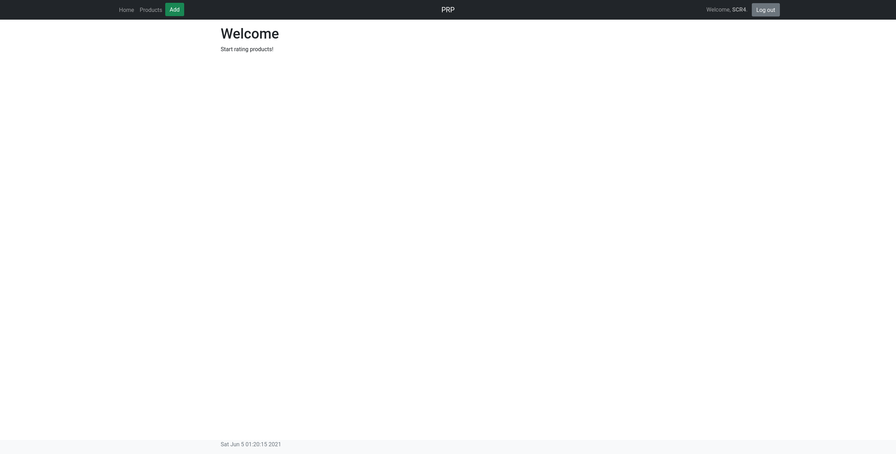

<<<
=== Logout
Der User SCR4 möchte sich abmelden:

.Registered

Der User findet den Logout Button

.Logout
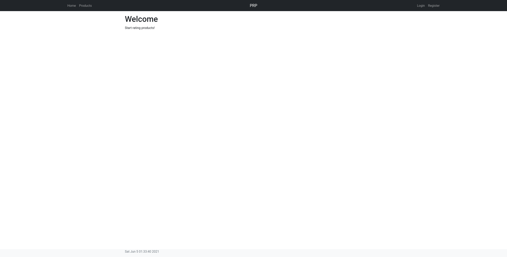

<<<
=== Login
Der User möchte sich anmelden

.Login View
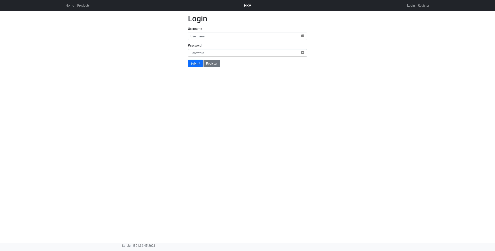

<<<

Er vergisst Username/Passwort

.Invalid Login
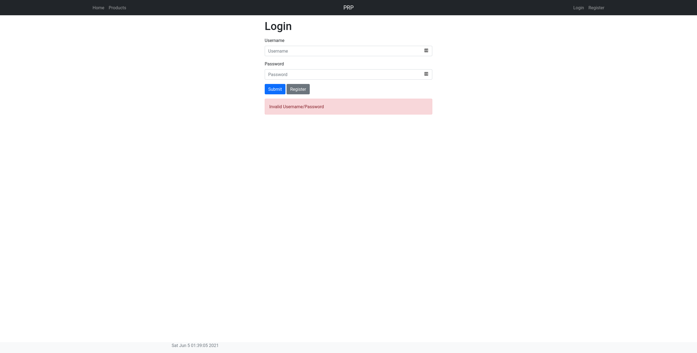

<<<

Glücklicherweise kann er sich dann daran erinnern.

.Valid Login

<<<
=== Produkte browsen
Der User möchte sich einige Produkte ansehen.

.Productlist
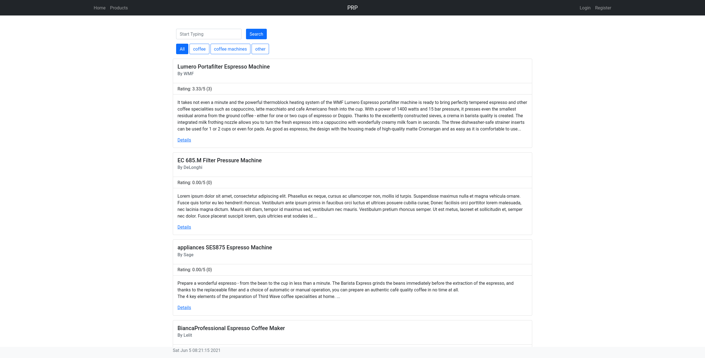

<<<

Er schaut sich die verschiedenen Kategorien an.

.Categories
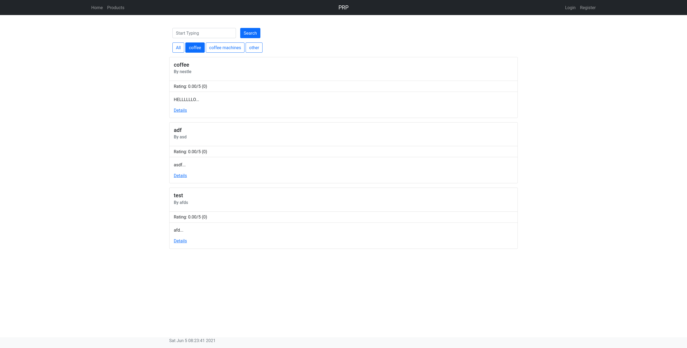

<<<

Und sucht auch nach bestimmten Produkten

.Search
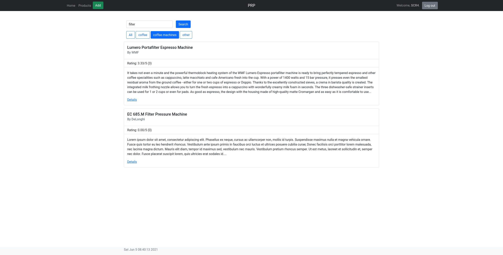

<<<
=== Produkt Details und Kommentar

Der User schaut sich die Maschine genauer an.

.Detail View
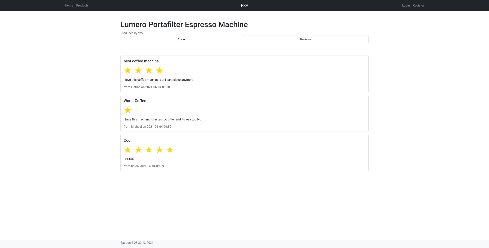

<<<

Er hat die selbe Maschine und möchte ein Kommentar dazu abgeben.

.Add Rating
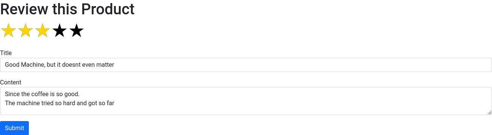

<<<

Dann kommt der User darauf, dass der Kommentar überflüssig war und löscht ihn gleich wieder.

.Delete Rating
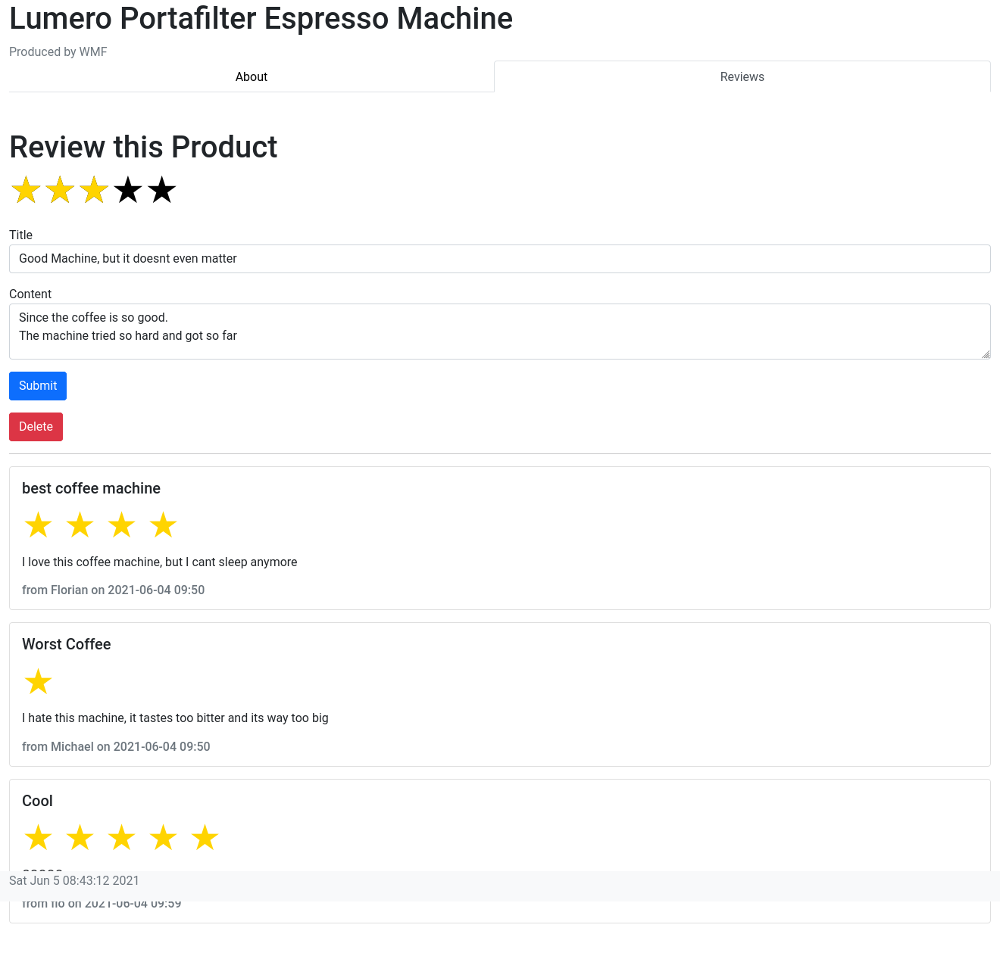

<<<

Der Kommentar wurde erfolgreich gelöscht.

.Deleted Rating
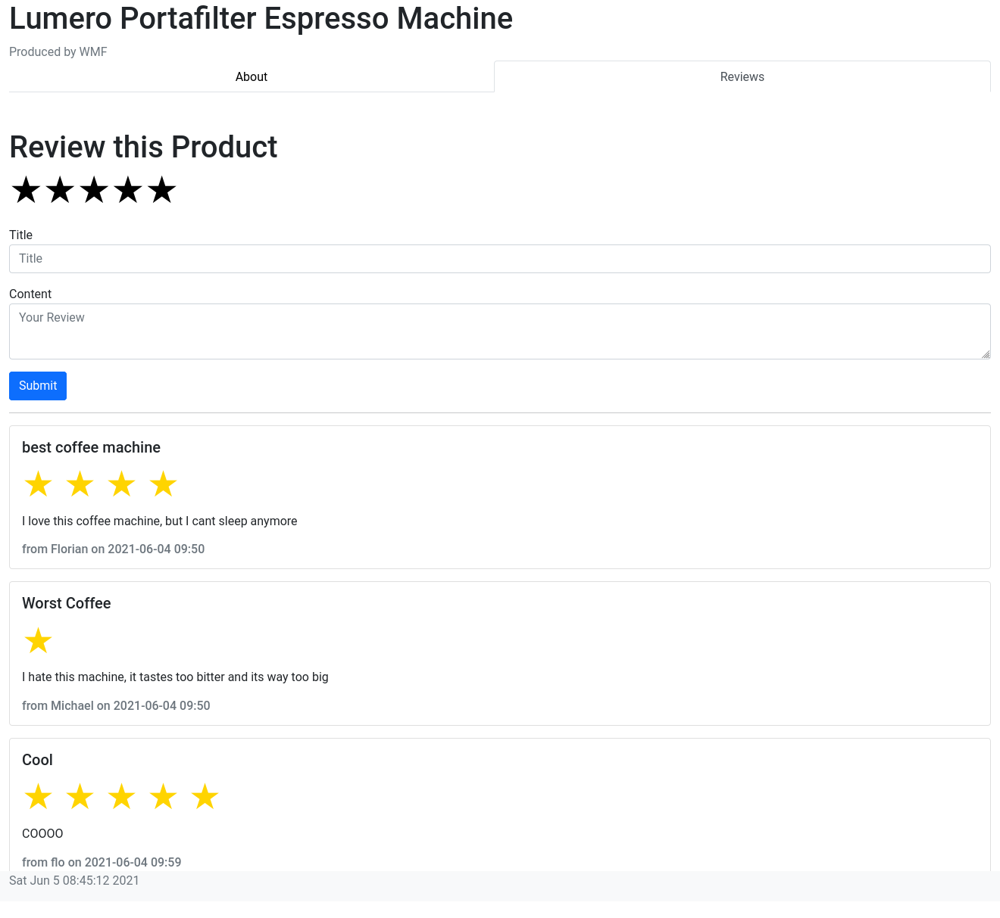

<<<
=== Produkt hinzufügen
Der User hat eine neue Kaffeesorte entdeckt und möchte sie hinzufügen.

.Add Product
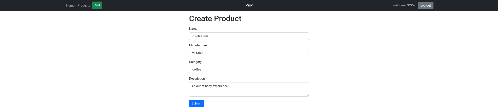

Das Produkt wurde hinzugefügt.

.Added Product
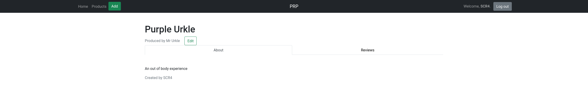

